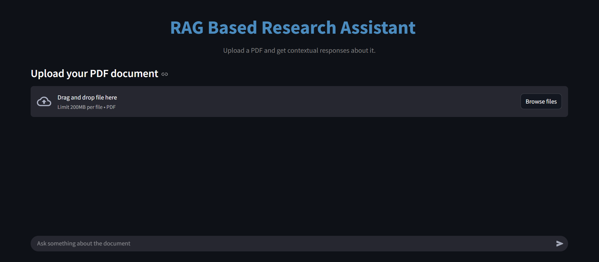
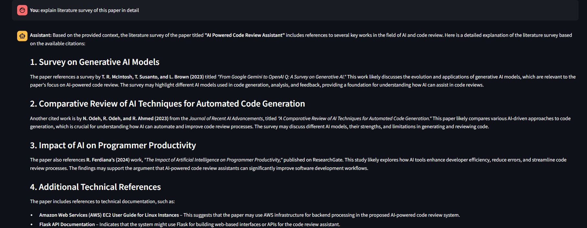
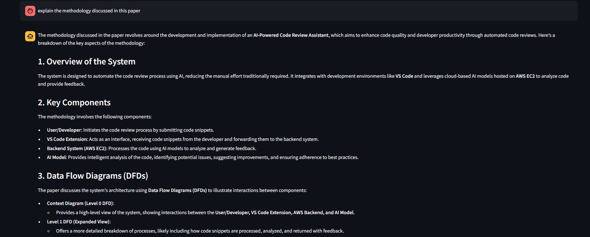
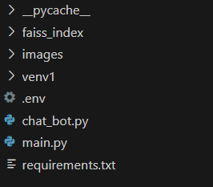

# Research-Assistant

This is an AI-powered **PDF Research Assistant** built using LangChain, FAISS, and MistralAI. It allows users to upload a PDF and ask context-aware questions about its contents through a chat interface built using Streamlit. The app performs **Retrieval-Augmented Generation (RAG)** to fetch relevant parts of the document and generate accurate responses.

Technologies Used

- **Streamlit** – For the web app interface
- **LangChain** – To build the RAG pipeline and manage LLM chains
- **FAISS** – For efficient vector similarity search over document chunks
- **Mistral AI** – Used as the LLM backend via `langchain_mistralai`
- **HuggingFace Embeddings** – To convert text into dense vectors

RAG Pipeline:

1. **Indexing**  
   - Load the PDF using `PyPDFLoader`
   - Split the text into overlapping chunks
   - Convert each chunk into vector embeddings using `sentence-transformers/all-MiniLM-L6-v2`
   - Store the chunks and vectors in a FAISS vector database

2. **Retrieval**  
   - When a user asks a question, fetch the most relevant document chunks using FAISS similarity search

3. **Augmentation**  
   - Add the retrieved context into a custom prompt template

4. **Generation**  
   - Use the Mistral LLM to generate a final answer using both the query and context

**STREAMLIT UI**

**RESPONSE TO USER QUERY** - based on the context of the research paper

**RESPONSE TO USER QUERY** - response to second question based on context of research paper and previous user history

**FILE STRUCTURE**

